# Podinfo Deployment System - Architecture

## System Overview

The Podinfo Deployment System is a comprehensive DevOps solution that demonstrates modern cloud-native deployment practices with dual-target deployment (Lambda + EC2), blue/green deployments, supply chain security, and comprehensive observability.

## Architecture Diagram

```mermaid
graph TB
    subgraph "GitHub Actions CI/CD"
        GA[GitHub Actions]
        BUILD[Build & Sign Images]
        SBOM[Generate SBOM]
        VERIFY[Verify Signatures]
        DEPLOY[Deploy to AWS]
    end

    subgraph "AWS Global Infrastructure"
        ECR[ECR Repositories]
        IAM[IAM Roles & Policies]
        KMS[KMS Keys]
        SNS[SNS Topics]
        SECRETS[AWS Secrets Manager]
    end

    subgraph "AWS Lambda Deployment"
        LAMBDA[Lambda Function]
        API[API Gateway]
        LAMBDA_ALIAS[Lambda Alias]
        LAMBDA_LOGS[CloudWatch Logs]
    end

    subgraph "AWS EC2 Deployment"
        ALB[Application Load Balancer]
        ASG[Auto Scaling Group]
        EC2_1[EC2 Instance 1]
        EC2_2[EC2 Instance 2]
        VPC[VPC]
        SUBNET_PUB[Public Subnets]
        SUBNET_PRIV[Private Subnets]
        NAT[NAT Gateway]
    end

    subgraph "Blue/Green Deployment"
        BLUE_TG[Blue Target Group]
        GREEN_TG[Green Target Group]
        CODEDEPLOY[CodeDeploy]
        TRAFFIC[Traffic Shifting]
    end

    subgraph "Observability & Monitoring"
        CLOUDWATCH[CloudWatch]
        DASHBOARD[Dashboard]
        ALARMS[Alarms]
        LOGS[Log Groups]
        METRICS[Metrics]
    end

    subgraph "Security & Compliance"
        COSIGN[Cosign Signing]
        SYFT[SBOM Generation]
        TRIVY[Vulnerability Scanning]
        ROTATION[Secret Rotation]
    end

    %% CI/CD Flow
    GA --> BUILD
    BUILD --> SBOM
    BUILD --> COSIGN
    SBOM --> ECR
    COSIGN --> ECR
    VERIFY --> DEPLOY

    %% Deployment Flow
    DEPLOY --> LAMBDA
    DEPLOY --> EC2_1
    DEPLOY --> EC2_2

    %% Lambda Architecture
    API --> LAMBDA
    LAMBDA --> LAMBDA_ALIAS
    LAMBDA --> LAMBDA_LOGS
    LAMBDA --> SECRETS

    %% EC2 Architecture
    ALB --> BLUE_TG
    ALB --> GREEN_TG
    BLUE_TG --> EC2_1
    GREEN_TG --> EC2_2
    ASG --> EC2_1
    ASG --> EC2_2
    EC2_1 --> VPC
    EC2_2 --> VPC
    VPC --> SUBNET_PUB
    VPC --> SUBNET_PRIV
    SUBNET_PRIV --> NAT

    %% Blue/Green Flow
    CODEDEPLOY --> TRAFFIC
    TRAFFIC --> BLUE_TG
    TRAFFIC --> GREEN_TG

    %% Observability
    LAMBDA --> CLOUDWATCH
    EC2_1 --> CLOUDWATCH
    EC2_2 --> CLOUDWATCH
    ALB --> CLOUDWATCH
    CLOUDWATCH --> DASHBOARD
    CLOUDWATCH --> ALARMS
    CLOUDWATCH --> LOGS
    CLOUDWATCH --> METRICS

    %% Security
    COSIGN --> ECR
    SYFT --> ECR
    TRIVY --> ECR
    ROTATION --> SECRETS

    %% External Access
    USER[Users] --> API
    USER --> ALB
```



## Component Details

### 1. CI/CD Pipeline (GitHub Actions)

**Build & Sign Workflow** (`build.yml`):
- Builds container images for both Lambda and EC2
- Signs images with Cosign for supply chain security
- Generates SBOM with Syft
- Scans for vulnerabilities with Trivy
- Pushes signed images to ECR

**Deploy Workflow** (`deploy.yml`):
- Deploys to both Lambda and EC2 targets
- Implements blue/green deployment strategy
- Runs smoke tests and synthetic tests
- Verifies image signatures before deployment

**Promote Workflow** (`promote.yml`):
- Promotes artifacts from dev → staging → prod
- Includes human approval gates for production
- Implements immutable digest promotion
- Supports rollback capabilities

### 2. AWS Lambda Deployment

**Components**:
- **Lambda Function**: Container-based Go application
- **API Gateway**: HTTP API with custom domain
- **Lambda Alias**: Traffic management and versioning
- **Provisioned Concurrency**: Reduces cold start times

**Features**:
- Automatic scaling based on request volume
- Pay-per-request pricing model
- Built-in monitoring and logging
- Integration with AWS Secrets Manager

### 3. AWS EC2 Deployment

**Components**:
- **Application Load Balancer**: Distributes traffic across instances
- **Auto Scaling Group**: Manages EC2 instance lifecycle
- **VPC**: Isolated network environment
- **Security Groups**: Network access control

**Features**:
- Multi-AZ deployment for high availability
- Auto scaling based on CPU utilization
- Health checks and instance replacement
- Integration with AWS Secrets Manager

### 4. Blue/Green Deployment

**Components**:
- **Blue Target Group**: Current production traffic
- **Green Target Group**: New deployment traffic
- **CodeDeploy**: Manages deployment process
- **Traffic Shifting**: Gradual traffic migration

**Process**:
1. Deploy new version to green environment
2. Run health checks and smoke tests
3. Gradually shift traffic from blue to green
4. Monitor metrics and rollback if needed
5. Decommission blue environment after validation

### 5. Supply Chain Security

**Image Signing**:
- **Cosign**: Signs container images with keyless signing
- **Verification**: Verifies signatures before deployment
- **Policy Gates**: Blocks unsigned images

**SBOM Generation**:
- **Syft**: Generates Software Bill of Materials
- **Storage**: SBOMs stored in ECR
- **Compliance**: Enables supply chain transparency

**Vulnerability Scanning**:
- **Trivy**: Scans images for known vulnerabilities
- **SARIF**: Uploads scan results to GitHub Security
- **Policy Gates**: Blocks vulnerable images

### 6. Secrets Management

**Components**:
- **AWS Secrets Manager**: Centralized secret storage
- **Secret Rotation**: Automatic rotation every 7 days
- **Lambda Function**: Custom rotation logic
- **KMS Encryption**: Secrets encrypted at rest

**Features**:
- Automatic rotation with custom logic
- Integration with application code
- Audit logging and access tracking
- Cross-service secret sharing

### 7. Observability & Monitoring

**CloudWatch Dashboard**:
- System overview with environment details
- Lambda metrics (invocations, errors, duration)
- ALB metrics (request count, response time)
- EC2 metrics (CPU, memory, network)
- Application health metrics
- Blue/green deployment status
- Secrets rotation status
- Correlation ID tracking

**Alarms**:
- Lambda errors and throttles
- EC2 CPU utilization
- ALB target health
- Application health status
- SNS notifications for alerts

**Logging**:
- Centralized log groups for all services
- Correlation ID tracking across requests
- Structured logging with JSON format
- Log retention and archival policies

## Data Flow

### 1. Request Flow

**Lambda Path**:
```
User → API Gateway → Lambda Function → Secrets Manager → Response
```

**EC2 Path**:
```
User → ALB → Target Group → EC2 Instance → Secrets Manager → Response
```

### 2. Deployment Flow

**Build Phase**:
```
Code Push → GitHub Actions → Build Images → Sign Images → Generate SBOM → Push to ECR
```

**Deploy Phase**:
```
ECR Images → Deploy to Lambda → Deploy to EC2 → Run Tests → Update Traffic
```

**Promote Phase**:
```
Dev Environment → Staging Environment → Production Environment (with approval)
```

### 3. Monitoring Flow

**Metrics Collection**:
```
Application → CloudWatch Metrics → Dashboard → Alarms → SNS → Notifications
```

**Log Collection**:
```
Application → CloudWatch Logs → Log Groups → Dashboard → Correlation Tracking
```

## Security Architecture

### 1. Network Security
- VPC with public and private subnets
- Security groups with least privilege access
- NAT Gateway for outbound internet access
- No direct internet access to EC2 instances

### 2. Application Security
- Container images signed with Cosign
- SBOM generation for supply chain transparency
- Vulnerability scanning with Trivy
- Secrets encrypted with KMS

### 3. Access Control
- IAM roles with minimal permissions
- OIDC integration with GitHub Actions
- Secrets Manager with rotation
- Audit logging for all actions

## Scalability Considerations

### 1. Lambda Scaling
- Automatic scaling based on request volume
- Provisioned concurrency for consistent performance
- Reserved concurrency to prevent throttling
- Connection pooling for external services

### 2. EC2 Scaling
- Auto Scaling Group with multiple AZs
- Predictive scaling based on historical data
- Custom metrics for application-specific scaling
- Health checks for instance replacement

### 3. Database Scaling (Future)
- RDS Multi-AZ for high availability
- Read replicas for read-heavy workloads
- Connection pooling with PgBouncer
- ElastiCache for frequently accessed data

## Cost Optimization

### 1. Lambda Costs
- Provisioned concurrency only when needed
- Right-sizing memory allocation
- Optimized container images
- Reserved concurrency for predictable workloads

### 2. EC2 Costs
- Spot instances for non-critical workloads
- Reserved instances for predictable usage
- Auto scaling to prevent over-provisioning
- Regular right-sizing analysis

### 3. Storage Costs
- ECR lifecycle policies for image cleanup
- CloudWatch log retention policies
- S3 lifecycle policies for backups
- Cost allocation tags for tracking

## Disaster Recovery

### 1. Multi-AZ Deployment
- EC2 instances across multiple availability zones
- RDS Multi-AZ for database redundancy
- ALB health checks for automatic failover
- Cross-AZ replication for data durability

### 2. Backup Strategy
- ECR image replication across regions
- CloudWatch log archival to S3
- Secrets Manager cross-region replication
- Infrastructure as Code for rapid recovery

### 3. Rollback Procedures
- Blue/green deployment for instant rollback
- Lambda version management for quick reversion
- Database point-in-time recovery
- Automated rollback triggers based on metrics

## Compliance & Governance

### 1. Supply Chain Security
- Image signing and verification
- SBOM generation and storage
- Vulnerability scanning and reporting
- Policy gates for security compliance

### 2. Audit & Logging
- CloudTrail for API call logging
- CloudWatch for application logging
- Secrets Manager access logging
- Cost and usage reporting

### 3. Change Management
- Infrastructure as Code with Terraform
- Git-based change tracking
- Pull request reviews for changes
- Automated testing and validation

This architecture provides a robust, scalable, and secure foundation for modern cloud-native applications while demonstrating best practices in DevOps, security, and observability.