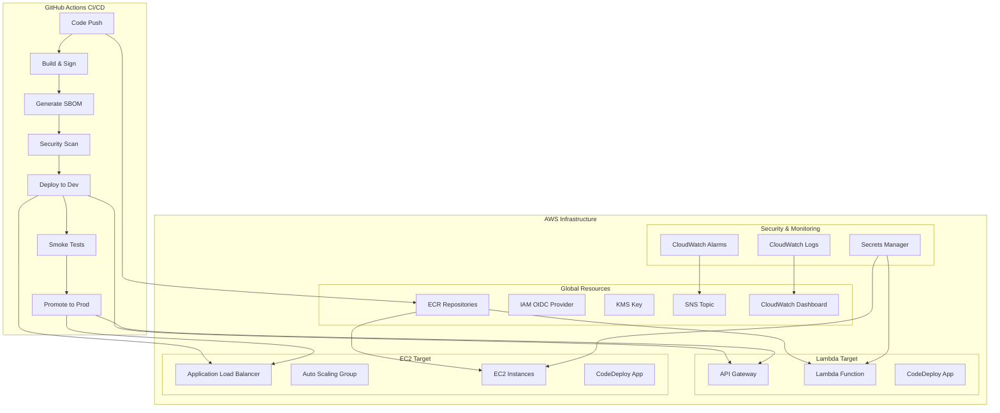
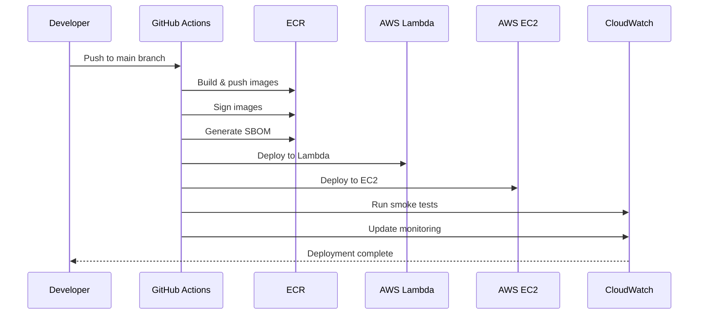
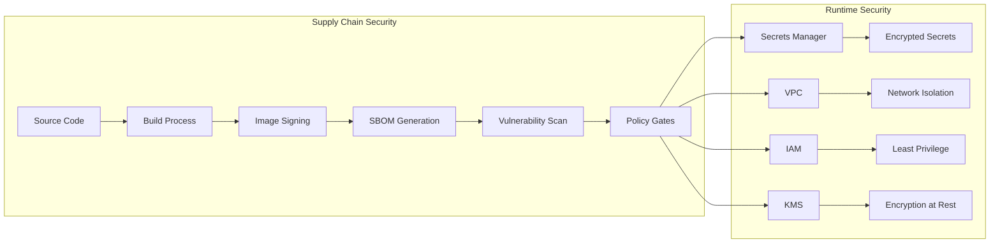
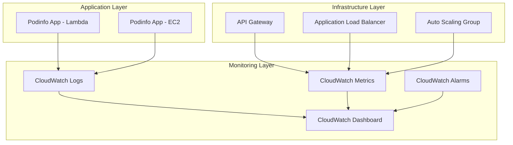

# Architecture Overview

## System Architecture

## Deployment Flow

## Security Architecture

## Monitoring Architecture

## Key Components

### CI/CD Pipeline
- **Build**: Container image building and signing
- **Sign**: Cosign keyless signing with GitHub OIDC
- **SBOM**: Software Bill of Materials generation
- **Scan**: Trivy vulnerability scanning
- **Deploy**: Dual target deployment (Lambda + EC2)
- **Test**: Automated smoke tests and validation

### Infrastructure
- **Global**: ECR, IAM, KMS, SNS, CloudWatch
- **Lambda**: API Gateway, Lambda function, CodeDeploy
- **EC2**: VPC, ALB, Auto Scaling Group, CodeDeploy
- **Security**: Secrets Manager, VPC, Security Groups

### Monitoring
- **Logs**: Centralized logging for all components
- **Metrics**: Performance and health metrics
- **Alarms**: Automated alerting for failures
- **Dashboard**: Real-time system overview

### Security
- **Supply Chain**: Image signing, SBOM, vulnerability scanning
- **Runtime**: Secrets management, network isolation, encryption
- **Access**: IAM roles with least privilege
- **Compliance**: Audit trails and policy enforcement
